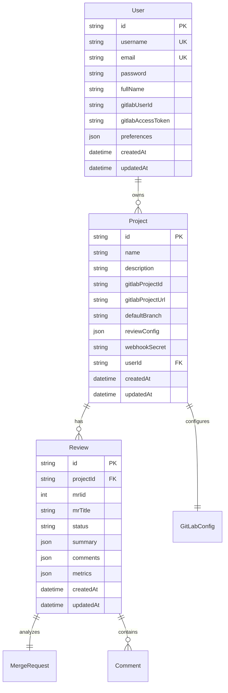

# Technical Architecture Document

## Technology Stack

### 前端技术栈
```
Vue 3.5+ (Composition API)
├── 核心框架
│   ├── Vue 3.5 - 渐进式框架
│   ├── TypeScript 5.0 - 类型安全
│   └── Vite 5.0 - 快速构建工具
├── 状态管理
│   ├── Pinia 2.2 - 官方状态管理
│   └── VueUse 11.0 - 组合式工具集
├── UI框架
│   ├── Element Plus 2.9 - 企业级组件库
│   ├── TailwindCSS 3.4 - 原子化CSS
│   └── UnoCSS - 即时原子化CSS引擎
├── 路由与请求
│   ├── Vue Router 4.0 - 官方路由
│   ├── Axios 1.7 - HTTP客户端
│   └── Tanstack Query - 数据同步
└── 开发工具
    ├── ESLint 9.0 - 代码检查
    ├── Prettier 3.0 - 代码格式化
    ├── Vitest 2.0 - 单元测试
    └── Playwright 1.48 - E2E测试
```

### 后端技术栈
```
NestJS 11.0+ (Node.js)
├── 核心框架
│   ├── NestJS 11.0 - 企业级Node框架
│   ├── TypeScript 5.7 - 类型安全
│   └── Node.js 20 LTS - 运行时
├── 数据层
│   ├── Prisma 6.16 - 现代ORM框架
│   ├── MySQL 8.0 - 主数据库
│   └── Redis 7.2 - 缓存层
├── GitLab集成
│   ├── GitBeaker 35.8 - GitLab API客户端
│   └── Webhook处理 - 事件驱动架构
├── 消息队列
│   ├── Bull 4.16 - 任务队列
│   └── Socket.io 4.8 - 实时通信
└── 安全与监控
    ├── Passport.js - JWT认证
    ├── Bcrypt - 密码加密
    └── Swagger - API文档
```

### AI服务技术栈
```
Python 3.11+ (FastAPI)
├── 核心框架
│   ├── FastAPI 0.115 - 高性能Web框架
│   ├── Pydantic 2.10 - 数据验证
│   └── Uvicorn - ASGI服务器
├── AI集成
│   ├── OpenAI SDK - LLM调用
│   ├── LangChain 0.3 - LLM编排
│   └── Anthropic SDK - Claude集成
└── 工具库
    ├── httpx 0.27 - 异步HTTP
    ├── tenacity 9.0 - 重试机制
    └── structlog - 结构化日志
```

## Architecture Patterns

### 前端架构模式

#### 1. 分层架构
```
src/
├── views/          # 页面组件
├── components/     # 通用组件
├── composables/    # 组合式函数
├── stores/         # 状态管理
├── services/       # API服务层
├── utils/          # 工具函数
└── types/          # TypeScript类型
```

#### 2. 组件设计原则
- **原子设计**: 从原子到页面的组件层次
- **单一职责**: 每个组件只负责一个功能
- **Props向下，Events向上**: 单向数据流
- **组合优于继承**: 使用组合式API和插槽

#### 3. 状态管理策略
```typescript
// 全局状态 - Pinia Store
useUserStore()      // 用户认证状态
useProjectStore()   // 项目管理状态
useReviewStore()    // 审查记录状态

// 局部状态 - Composables
useLocalStorage()   // 本地存储
useWebSocket()      // 实时连接
useNotification()   // 通知管理
```

### 后端架构模式

#### 1. 模块化设计
```
src/
├── auth/           # 认证授权模块
├── users/          # 用户管理模块
├── projects/       # 项目管理模块
├── gitlab/         # GitLab集成模块
├── review/         # 代码审查模块
├── ai/             # AI服务集成
├── common/         # 共享功能
│   ├── guards/     # 守卫
│   ├── filters/    # 过滤器
│   └── pipes/      # 管道
├── prisma/         # Prisma配置
└── main.ts         # 应用入口
```

#### 2. 适配器模式
```typescript
interface IRepositoryProvider {
  fetchDiff(mrId: string): Promise<Diff>
  postComment(comment: Comment): Promise<void>
  updateMR(data: MRUpdate): Promise<void>
}

// 实现
class GitLabProvider implements IRepositoryProvider {}
class GitHubProvider implements IRepositoryProvider {}
```

#### 3. 事件驱动架构
```typescript
// 事件发布
eventEmitter.emit('mr.created', { projectId, mrId })

// 事件处理
@OnEvent('mr.created')
async handleMRCreated(payload: MRCreatedEvent) {
  await this.queueService.add('review', payload)
}
```

## API Design

### RESTful API规范
```
GET    /api/projects          # 获取项目列表
POST   /api/projects          # 创建项目
GET    /api/projects/:id      # 获取项目详情
PUT    /api/projects/:id      # 更新项目
DELETE /api/projects/:id      # 删除项目

GET    /api/reviews           # 获取审查列表
GET    /api/reviews/:id       # 获取审查详情
POST   /api/reviews/retry/:id # 重试审查
```

### WebSocket事件
```
// 客户端 -> 服务端
subscribe:project    # 订阅项目更新
unsubscribe:project  # 取消订阅

// 服务端 -> 客户端
review:started       # 审查开始
review:progress      # 审查进度
review:completed     # 审查完成
review:failed        # 审查失败
```

### GraphQL考虑（未来）
```graphql
type Review {
  id: ID!
  project: Project!
  mr: MergeRequest!
  summary: String
  comments: [Comment!]!
  status: ReviewStatus!
  createdAt: DateTime!
}
```

## Data Models

### 核心实体关系


### 数据流设计
```
用户操作 -> API Gateway -> 业务逻辑 -> 数据持久化
    ↓           ↓              ↓            ↓
  JWT验证    限流/缓存     Prisma ORM     MySQL
```

## Security Architecture

### 认证与授权
1. **JWT Token认证**
   - Access Token: 15分钟有效期
   - Refresh Token: 7天有效期
   - 签名算法: RS256

2. **权限模型 (RBAC)**
   ```
   Owner    -> 全部权限
   Admin    -> 管理项目和用户
   Developer -> 查看和触发审查
   Viewer   -> 只读权限
   ```

3. **API安全**
   - Rate Limiting: 100 req/min
   - CORS配置: 白名单域名
   - CSP头: 严格内容安全策略
   - XSS防护: 输入验证和转义

### 数据安全
1. **加密存储**
   - GitLab Token: AES-256-GCM
   - 敏感配置: 环境变量+密钥管理
   - 数据库: TLS连接

2. **传输安全**
   - HTTPS Only
   - HSTS启用
   - Certificate Pinning (App)

3. **代码安全**
   - 不记录敏感信息
   - 代码片段用后即焚
   - 审计日志脱敏

## Performance Optimization

### 前端性能
1. **加载优化**
   - 路由懒加载
   - 组件异步加载
   - 资源预加载/预获取
   - CDN静态资源

2. **渲染优化**
   - 虚拟滚动
   - 防抖/节流
   - Web Workers
   - 离屏Canvas

3. **缓存策略**
   - Service Worker
   - IndexedDB本地存储
   - Memory Cache
   - HTTP缓存头

### 后端性能
1. **数据库优化**
   - 索引优化
   - 查询优化
   - 连接池管理
   - 读写分离

2. **缓存层**
   - Redis缓存热数据
   - 内存缓存频繁访问
   - CDN缓存静态资源
   - 查询结果缓存

3. **异步处理**
   - 消息队列解耦
   - 批量处理
   - 并行处理
   - 流式响应

## Monitoring & Observability

### 监控指标
1. **应用指标**
   - QPS/TPS
   - 响应时间P50/P95/P99
   - 错误率
   - 可用性

2. **业务指标**
   - 审查完成率
   - 平均审查时间
   - AI调用成功率
   - 用户活跃度

3. **基础设施**
   - CPU/内存使用率
   - 磁盘I/O
   - 网络流量
   - 容器健康

### 日志体系
```
结构化日志 -> Fluentd收集 -> ElasticSearch存储 -> Kibana可视化
```

### 链路追踪
```
OpenTelemetry -> Jaeger/Zipkin -> 分布式追踪可视化
```

## Deployment Architecture

### 容器化部署
```yaml
# Docker Compose (开发环境)
services:
  frontend:
    image: moonlens/frontend:latest
    ports: ["3000:80"]
    
  backend:
    image: moonlens/backend:latest
    ports: ["8080:8080"]
    depends_on: [postgres, redis]
    
  ai-service:
    image: moonlens/ai:latest
    ports: ["8081:8081"]
    depends_on: [redis]
```

### Kubernetes部署
```yaml
# 生产环境K8s部署
apiVersion: apps/v1
kind: Deployment
spec:
  replicas: 3
  strategy:
    type: RollingUpdate
    rollingUpdate:
      maxSurge: 1
      maxUnavailable: 0
```

### CI/CD Pipeline
```
代码提交 -> GitHub Actions -> 构建镜像 -> 推送Registry -> 部署K8s
    ↓           ↓               ↓            ↓              ↓
  触发钩子    运行测试      Docker Build   Harbor/ACR    ArgoCD
```

## Technology Decisions

### 选型理由

#### Vue 3 vs React
- ✅ Vue 3: 更低的学习曲线，更好的中文社区支持
- ✅ Composition API: 更好的TypeScript支持和逻辑复用
- ✅ 生态成熟: Element Plus等UI库的深度集成

#### NestJS vs Express
- ✅ NestJS: 企业级架构，内置DI和模块化
- ✅ TypeScript First: 完整的类型安全
- ✅ 装饰器支持: 更清晰的代码组织

#### MySQL vs PostgreSQL
- ✅ MySQL: 更广泛的托管服务支持，成本更低
- ✅ 团队熟悉度更高
- ✅ 性能稳定，适合OLTP场景
- ✅ 与现有基础设施更好集成

#### Prisma vs TypeORM  
- ✅ Prisma: 类型安全性更好，自动生成TypeScript类型
- ✅ 更现代的API设计，开发体验更好
- ✅ 内置迁移工具，版本管理更清晰
- ✅ 查询性能优化更智能

#### Redis vs RabbitMQ
- ✅ Redis + BullMQ: MVP阶段足够，简单高效
- 🔄 未来可迁移到RabbitMQ获得更强大的消息保证

### 技术债务管理
1. **识别债务**
   - 代码复杂度分析
   - 依赖过期检查
   - 性能瓶颈识别

2. **偿还策略**
   - 20%时间用于技术债务
   - 重构优先级排序
   - 渐进式改进

3. **预防措施**
   - 代码审查流程
   - 自动化测试覆盖
   - 架构决策记录(ADR)

## Migration Strategy

### 版本升级策略
1. **依赖更新**
   - 每月检查安全更新
   - 季度评估主版本升级
   - 自动化依赖扫描

2. **数据库迁移**
   - Prisma Migrate管理
   - prisma migrate dev (开发环境)
   - prisma migrate deploy (生产环境)
   - 版本化迁移文件
   - 自动回滚机制

3. **API版本控制**
   - URL版本: /api/v1, /api/v2
   - 兼容性保证期: 6个月
   - 弃用通知机制

### 扩展性规划
1. **水平扩展**
   - 无状态服务设计
   - 负载均衡配置
   - 自动扩缩容

2. **垂直扩展**
   - 资源监控和预警
   - 性能基准测试
   - 容量规划

3. **地理分布**
   - CDN全球加速
   - 多区域部署
   - 数据同步策略

## Developer Experience

### 开发环境
```bash
# 一键启动开发环境
pnpm dev

# 自动化工具链
- Hot Module Replacement
- TypeScript类型检查
- ESLint实时检查
- 自动格式化
```

### 代码规范
1. **命名约定**
   - 组件: PascalCase
   - 函数: camelCase
   - 常量: UPPER_SNAKE_CASE
   - 文件: kebab-case

2. **Git规范**
   - Conventional Commits
   - 分支策略: Git Flow
   - PR模板和检查清单

3. **文档要求**
   - README必须包含快速开始
   - API文档自动生成
   - 架构决策记录(ADR)

## Future Considerations

### 技术演进路线
1. **短期 (3个月)**
   - 完善核心功能
   - 性能优化
   - 测试覆盖率>80%

2. **中期 (6个月)**
   - RAG集成
   - 微前端架构
   - GraphQL API

3. **长期 (12个月)**
   - 服务网格(Istio)
   - 多租户架构
   - AI模型本地化

### 技术储备
- WebAssembly: 前端性能优化
- Edge Computing: 边缘节点部署
- Rust: 高性能服务重写
- Web3: 去中心化存储

### 风险与挑战
1. **技术风险**
   - LLM API稳定性
   - 大规模并发处理
   - 实时性要求

2. **缓解措施**
   - 多Provider容错
   - 缓存和队列优化
   - WebSocket长连接池